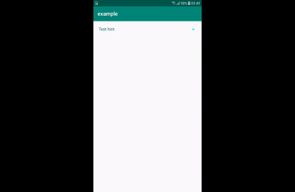

# GBKSoftSpinnerView

Well customizing widget that can be used instead of native Spinner to show dropdown list.<br/>
SpinnerView extends TextView, so you can apply any attributes that available for TextView.<br/>
It makes customizing process easy.



# Installation
Add to the top level gradle file:
```groovy
allprojects {
    repositories {
        ...
        maven { url 'https://jitpack.io' }
    }
}
```

Add to the app level gradle:
```groovy
dependencies {
        implementation 'com.github.gbksoft:GBKSoftSpinnerView:v1.0.1'
}
```


# Layout

```xml
<com.gbksoft.spinnerview.SpinnerView
        android:id="@+id/spinner"
        android:layout_width="match_parent"
        android:layout_height="wrap_content"
        android:layout_margin="20dp"
        android:padding="8dp"
        android:hint="Test hint"
        android:textColor="@color/colorAccent"
        android:textColorHint="@color/colorPrimary"
        app:sv_arrow_drawable="@drawable/ic_dropdown_arrow_animated"
        app:sv_arrow_tint="@android:color/holo_blue_bright"
        app:sv_dropdown_background="@drawable/bgn_dropdown"
        app:sv_dropdown_elevation="1dp"
        app:sv_dropdown_height="wrap_content"
        app:sv_dropdown_max_height="350dp"
        app:sv_dropdown_displayed_items_count="5"
        app:sv_dropdown_adapt_height_to_items_size="true"
         />
```
            
# Customizing

There are some additional attributes to configure dropdown:

| Attribute                              | Info |
| ----------------------                 | ------ |
| sv_arrow_drawable                      | right arrow icon that indicate dropdown status (expanded / collapsed) |
| sv_arrow_tint                          | tint color for right arrow | 
| sv_dropdown_background                 | Background drawable for dropdown | 
| sv_dropdown_elevation                  | Dropdown elevation | 
| sv_dropdown_max_height                 | Dropdown max height (it will not expand more than this value) |
| sv_dropdown_displayed_items_count      | Set count of displayed items in dropdown view|
| sv_dropdown_adapt_height_to_items_size | This flag will resize dropdown view size to match of full view height|
| sv_dropdown_height                     | match_parent, wrap_content|

To make arrow rotatable define sv_arrow_drawable like this:

```xml
<rotate xmlns:android="http://schemas.android.com/apk/res/android"
    android:drawable="@drawable/ic_dropdown_arrow"
    android:fromDegrees="0"
    android:pivotX="50%"
    android:pivotY="50%"
    android:toDegrees="180" />
```
# Usage in code

To add items into dropdown you have to set adapter to SpinnerView. Adapter must extend SpinnerAdapter.


```java
final SpinnerView spinner = findViewById(R.id.spinner);
spinner.setAdapter(spinnerAdapter); //Adapter must extend SpinnerAdapter

spinner.setOnItemSelectedListener(new SpinnerView.OnItemSelectedListener() {
    @Override
    public void onItemSelected(int position) {
        //Item selected
    }
});

spinner.setOnNothingSelectedListener(new SpinnerView.OnNothingSelectedListener() {

    @Override
    public void onNothingSelected() {
        //Nothing selected
    }
});
```
# Let us know
We'd be very happy if you sent links to your projects where you use our component. Just send us email to [github@gbksoft.com](mailto:github@gbksoft.com)